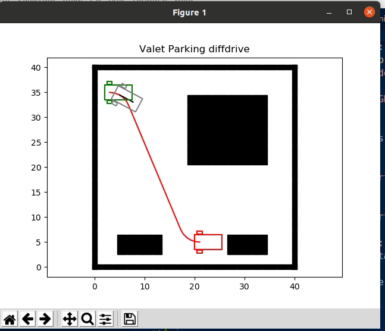
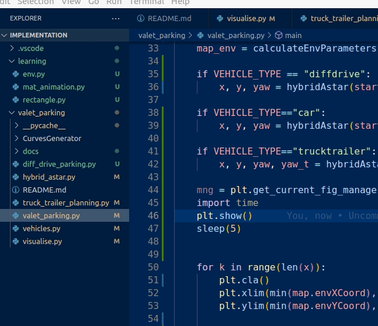
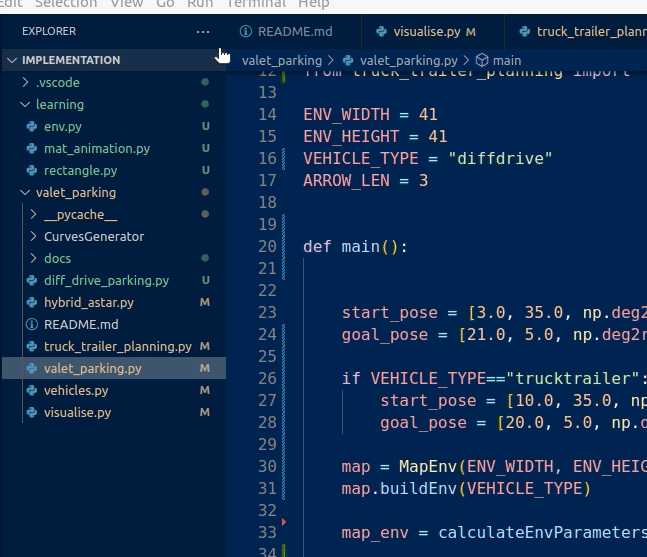

#Valet Parking Motion Planning 550

Uses Hybrid A star for kino-dynamic constrained motion planning for parking valet between the two other vehicles shown as black blocks.

Uses motion primivites trajectory rollout to check cost of obstacles with Reeds Shep Path curve generator, backtracks using Hybrid AStar considering holonomic and non holonomic constraints. 

Objectives include to park following

- Differential drive delivery robot.
- Ackermann Steering Car
- Truck Trailer      
   

To the run the valet-parking please use python3 valet_parking.py
set the specific vehicle you wish to run 

1. 

2.

1. 

